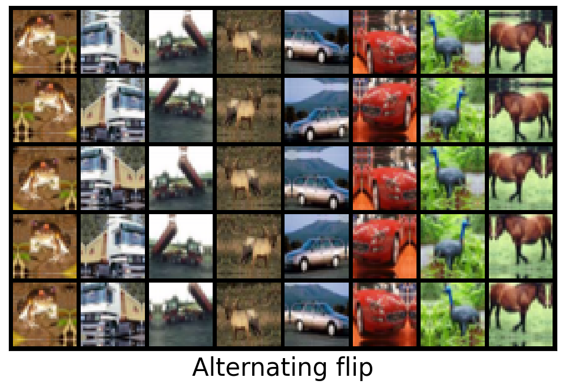
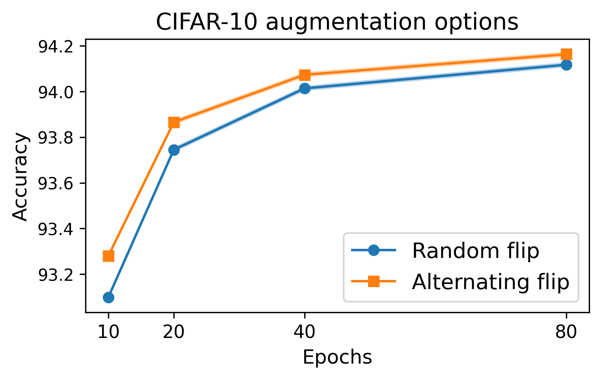

# CIFAR-10 Airbench 💨

Training methods for CIFAR-10 with state-of-the-art speed.

| Script | Mean accuracy | Time | PFLOPs |
| - | - | - | - |
| `airbench94_compiled.py` | 94.01% | 3.29s | 0.36 |
| `airbench94.py` | 94.01% | 3.83s | 0.36 |
| `airbench95.py` | 95.01% | 10.4s | 1.4 |
| `airbench96.py` | 96.03% | 34.7s | 4.9 |

Timings are on a single NVIDIA A100 GPU.
Note that the first run of training will be slower due to GPU warmup.

Paper: https://arxiv.org/abs/2404.00498 (Note: `airbench96` has been improved since the paper, from 46s to 35s.)

This project uses various novel training methods for maximum speed, including *alternating flip*.




## How to run

To train a neural network with 94% accuracy, run either

```
git clone https://github.com/KellerJordan/cifar10-airbench.git
python airbench/airbench94.py
```

or

```
pip install airbench
python -c "import airbench; airbench.warmup94(); airbench.train94()"
```

Note: `airbench94_compiled.py` and `airbench94.py` are equivalent (i.e., yield the same distribution of trained networks), and differ only in that the first uses `torch.compile` to improve GPU utilization. The former is intended for experiments where many networks are trained at once in order to amortize the one-time compilation cost.

## Motivation

CIFAR-10 is one of the most widely used datasets in machine learning, facilitating [thousands of research projects per year](https://paperswithcode.com/dataset/cifar-10). 
It is typically used for research which aims to understand fundamental properties of deep learning, rather than push the large-scale state-of-the-art.
This repo provides fast and stable training baselines for CIFAR-10 in order to help accelerate this research.
The trainings are provided as easily runnable dependency-free PyTorch scripts, and can replace classic baselines like training ResNet-20 or ResNet-18.


## Using the GPU-accelerated dataloader independently

For writing custom CIFAR-10 experiments or trainings, you may find it useful to use the GPU-accelerated dataloader independently.
```
import airbench
train_loader = airbench.CifarLoader('/tmp/cifar10', train=True, aug=dict(flip=True, translate=4, cutout=16), batch_size=500)
test_loader = airbench.CifarLoader('/tmp/cifar10', train=False, batch_size=1000)

for epoch in range(200):
    for inputs, labels in train_loader:
        # outputs = model(inputs)
        # loss = F.cross_entropy(outputs, labels)
        ...
```

If you wish to modify the data in the loader, it can be done like so:
```
import airbench
train_loader = airbench.CifarLoader('/tmp/cifar10', train=True, aug=dict(flip=True, translate=4, cutout=16), batch_size=500)
mask = (train_loader.labels < 6) # (this is just an example, the mask can be anything)
train_loader.images = train_loader.images[mask]
train_loader.labels = train_loader.labels[mask]
print(len(train_loader)) # The loader now contains 30,000 images and has batch size 500, so this prints 60.
```

## Example data-selection experiment

Airbench can be used as a platform for experiments in data selection and active learning.
The following is an example experiment which demonstrates the classic result that low-confidence examples provide more training signal than random examples.
It runs in <20 seconds on an A100.

```
import torch
from airbench import train94, infer, evaluate, CifarLoader

net = train94(label_smoothing=0) # train this network without label smoothing to get a better confidence signal

loader = CifarLoader('cifar10', train=True, batch_size=1000)
logits = infer(net, loader)
conf = logits.log_softmax(1).amax(1) # confidence

train_loader = CifarLoader('cifar10', train=True, batch_size=1024, aug=dict(flip=True, translate=2))
mask = (torch.rand(len(train_loader.labels)) < 0.6)
print('Training on %d images selected randomly' % mask.sum())
train_loader.images = train_loader.images[mask]
train_loader.labels = train_loader.labels[mask]
train94(train_loader, epochs=16) # yields around 93% accuracy

train_loader = CifarLoader('cifar10', train=True, batch_size=1024, aug=dict(flip=True, translate=2))
mask = (conf < conf.float().quantile(0.6))
print('Training on %d images selected based on minimum confidence' % mask.sum())
train_loader.images = train_loader.images[mask]
train_loader.labels = train_loader.labels[mask]
train94(train_loader, epochs=16) # yields around 94% accuracy => low-confidence sampling is better than random.
```

## Prior work

This project builds on the excellent previous record https://github.com/tysam-code/hlb-CIFAR10 (6.3 A100-seconds to 94%).

Which itself builds on the amazing series https://myrtle.ai/learn/how-to-train-your-resnet/ (26 V100-seconds to 94%, which is >=8 A100-seconds)

